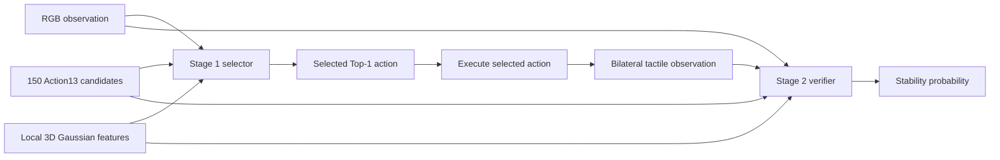

# ActiveTouchGS

**Gaussian-guided active visuo-tactile grasp stability prediction**

ActiveTouchGS is a two-stage framework for selecting and verifying stable
robot grasps. Given 150 candidate actions for an unseen object, Stage 1 ranks
the candidates before tactile sensing. After the selected action is executed,
Stage 2 combines the same visual/action representation with bilateral tactile
observations to predict grasp stability.

This repository provides the final training, inference and ablation code used
with the prepared ActiveTouchGS dataset. Dataset binaries and trained
checkpoints are distributed separately because of their size.

## Overview



### Stage 1: active grasp selection

For every candidate action, the selected model encodes:

- one shared RGB observation;
- a 13-D action vector containing target width, gripper center, two contact
  points and closing direction;
- local old12 Gaussian features from the left contact patch, right contact
  patch and closing corridor.

The network concatenates a 256-D RGB feature, a 64-D action feature and a
128-D local-GS relation feature into a 448-D representation, then predicts one
success logit. Candidates are ranked independently within each object.

### Stage 2: tactile verification

Stage 2 uses the same RGB, Action13 and local-GS representation and adds a
shared bilateral ResNet18 tactile encoder. It predicts one binary grasp
stability probability for the exact action selected by Stage 1; it does not
rerank the other candidates.

## Main results

All selector methods are evaluated on the same object-disjoint five-fold split
and the same 150-action candidate pool per object.

### Stage-1 selector comparison

| Method | S@1 (%) | H@5 (%) | H@10 (%) | MRR |
|---|---:|---:|---:|---:|
| Random Selector | 62.42 | 94.08 | 98.52 | 0.7599 |
| Geometry Selector | 52.63 | 100.00 | 100.00 | 0.7412 |
| Gaussian-Quality Selector | 52.63 | 100.00 | 100.00 | 0.7105 |
| Action Only | 84.21 (16/19) | 94.74 (18/19) | 100.00 (19/19) | 0.8760 |
| RGB + Action | 78.95 (15/19) | 94.74 (18/19) | 100.00 (19/19) | 0.8342 |
| RGB + Action + Depth | 73.68 (14/19) | 89.47 (17/19) | 94.74 (18/19) | 0.8100 |
| RGB + Action + Point Cloud | 78.95 (15/19) | 84.21 (16/19) | 94.74 (18/19) | 0.8207 |
| **ActiveTouchGS selector** | **89.47 (17/19)** | **94.74 (18/19)** | **100.00 (19/19)** | **0.9175** |
| Oracle Ranking | 100.00 (19/19) | 100.00 (19/19) | 100.00 (19/19) | 1.0000 |

- **S@1**: fraction of objects whose selected Top-1 action is successful.
- **H@K**: fraction of objects with at least one successful action in Top-K.
- **MRR**: mean reciprocal rank of the first successful candidate.

### Stage-2 tactile verification

The three variants below are evaluated on the same Stage-1-selected actions.

| Input | Accuracy | Macro-F1 | AUROC | AUPRC | ECE-5 (lower is better) |
|---|---:|---:|---:|---:|---:|
| Touch Only | 0.6842 | 0.5929 | 0.9706 | 0.9967 | 0.4322 |
| RGB + Action + Touch | 0.8947 | 0.7206 | 0.8088 | 0.9740 | 0.0943 |
| **RGB + Action + GS + Touch** | **0.9474** | **0.8190** | **0.9118** | **0.9896** | **0.0499** |

Exact paper-table values and the code corresponding to every row are stored
under `experiments/table2_primary_selector`,
`experiments/table3_tactile_verification`, and
`experiments/table4_selector_ablations`.

## Dataset and checkpoints

The prepared dataset and final five-fold checkpoints are distributed together
because the binary assets are too large for GitHub.

- **Download:** [ActiveTouchGS_external_files.zip (Baidu Netdisk)](https://pan.baidu.com/s/1QukccPOYJeF56yExBHPq1Q?pwd=bsx8)
- **Extraction code:** `bsx8`
- **SHA-256:** `71196b84a1006e7fdd6ca209b0dc101749bfd2854b10dbadac72e8699a0873ac`
- **Size:** 2,045,441,684 bytes (approximately 1.91 GiB)

The archive contains RGB, Action13, old12 local-GS features, bilateral tactile
observations, labels, fixed object-disjoint folds, and the selected Stage-1
and Stage-2 checkpoints.

Dataset summary:

| Item | Value |
|---|---:|
| Objects | 19 |
| Candidate actions per object | 150 |
| Total actions | 2,850 |
| Positive / negative | 1,779 / 1,071 |
| Actions with tactile observations | 2,769 |
| Evaluation protocol | 5-fold object-disjoint |

Extracted layout:

```text
ActiveTouchGS_external_files/
|-- README.txt
|-- ActiveTouchGS_dataset/
|   |-- data/
|   `-- metadata/
`-- ActiveTouchGS_final_checkpoints/
    |-- stage1_corridor_withgs/
    |   |-- fold_0/
    |   |-- ...
    |   `-- fold_4/
    `-- stage2_fullgs_touch/
        |-- fold_0/
        |-- ...
        `-- fold_4/
```

## Installation

One Python environment is sufficient for training and inference from the
prepared dataset. The Conda environment name is arbitrary.

```bash
conda create -n activetouchgs python=3.9.25 pip -y
conda activate activetouchgs
pip install -r requirements.txt
```

Raw PyBullet/TAXIM sampling, VGGT inference and 3DGS reconstruction are not
installed by `requirements.txt`, because their prepared outputs are already
contained in the dataset archive.

## Quick start

### 1. Extract and validate the dataset

Extract the archive once, preferably **beside** the Git repository rather
than inside it. The extracted directory is the only dataset root used by all
training and inference commands.

```bash
unzip ActiveTouchGS_external_files.zip -d /your_path

python scripts/dataset/validate_final_dataset.py \
  --dataset-root /your_path/ActiveTouchGS_external_files/ActiveTouchGS_dataset \
  --verify-sha256
```

No runtime-index generation step is needed. The archive already contains the
final labels and object-disjoint folds under `metadata/stage1` and
`metadata/stage2`. Asset paths are portable and are resolved against the
dataset root in memory. Stage 1 ignores tactile-only columns; both stages
retain the same `raw_pair_id` action identities and use the same old12 GS.

### 2. Configure paths

```bash
cp configs/training_paths.example.env configs/training_paths.env
```

Edit `configs/training_paths.env`, replace each `/your_path` placeholder, then
export it:

```bash
export ACTIVETOUCHGS_TRAINING_CONFIG="$PWD/configs/training_paths.env"
```

### 3. Train Stage 1

```bash
bash scripts/stage1/run_stage1_final_fivefold.sh
```

This launches the selected Stage-1 configuration on all five folds.

### 4. Train Stage 2

```bash
bash scripts/stage2/run_stage2_selected_fullgs_fivefold.sh
```

This launches the selected full-GS-and-touch Stage-2 configuration on all
five folds.

## Inference

### Stage-1-only candidate ranking

```bash
python src/evaluation/final/infer_stage1_fivefold.py \
  --data-root /your_path/ActiveTouchGS_external_files/ActiveTouchGS_dataset/metadata/stage1 \
  --run-root /your_path/ActiveTouchGS_external_files/ActiveTouchGS_final_checkpoints/stage1_corridor_withgs \
  --out-dir /your_path/results/stage1 \
  --device cuda
```

The script ranks all 150 candidates for every held-out object and reports
S@1, H@5, H@10 and MRR.

### Connected Stage-1 → Stage-2 inference

```bash
python src/evaluation/final/run_cascade.py \
  --stage1-data-root /your_path/ActiveTouchGS_external_files/ActiveTouchGS_dataset/metadata/stage1 \
  --stage1-run-root /your_path/ActiveTouchGS_external_files/ActiveTouchGS_final_checkpoints/stage1_corridor_withgs \
  --stage2-data-root /your_path/ActiveTouchGS_external_files/ActiveTouchGS_dataset/metadata/stage2 \
  --fullgs-run-root /your_path/ActiveTouchGS_external_files/ActiveTouchGS_final_checkpoints/stage2_fullgs_touch \
  --out-dir /your_path/results/cascade \
  --stage2-variants fullgs \
  --device cuda
```

Stage 1 selects one action per object. The connector uses `raw_pair_id` to
locate the exact same action in Stage 2, which outputs its stability
probability without changing the Stage-1 ranking.

## Reproducing the paper tables

```text
experiments/
├── table2_primary_selector/       primary selector comparison
├── table3_tactile_verification/   tactile-verification comparison
└── table4_selector_ablations/     modality, GS-region, pooling and loss ablations
```

Each table directory provides:

- `methods.csv`: mapping from every table row to its executable source;
- `results.csv`: frozen values reported in the paper;
- `methods/`: the corresponding training or evaluation implementations;
- `README.md`: table-specific execution notes.

Non-neural Table-2 baselines—Random, Geometry, Gaussian-Quality and Oracle—are
implemented together in `non_neural_selectors.py`. Neural methods use their
own method directories.

## Repository structure

```text
ActiveTouchGS/
├── configs/       portable path templates
├── experiments/   Table 2, Table 3 and Table 4 implementations/results
├── manifests/     file inventory and SHA-256 values
├── reports/       frozen per-fold predictions and paper-facing results
├── scripts/       dataset, training and evaluation launchers
├── src/           final Stage-1, Stage-2 and connected-inference source
├── README.md
└── requirements.txt
```

## Reproducibility scope

This compact release reproduces training, evaluation and connected inference
from the prepared dataset. It intentionally excludes raw simulator/physical
collection code, VGGT inference, 3DGS reconstruction trees, copied third-party
repositories, obsolete experiments and machine-specific absolute paths.

The prepared data were produced with upstream systems including ObjectFolder,
PyBullet/TAXIM, VGGT and 3D Gaussian Splatting tooling. Redistribution of
prepared observations must comply with their applicable terms. SHA-256 values
verify archive identity but do not grant redistribution rights.

## Citation

Citation metadata will be added after the final paper record is available.

## License

Add the approved source-code license before making the repository public.
Dataset and checkpoint redistribution terms should be stated separately.
